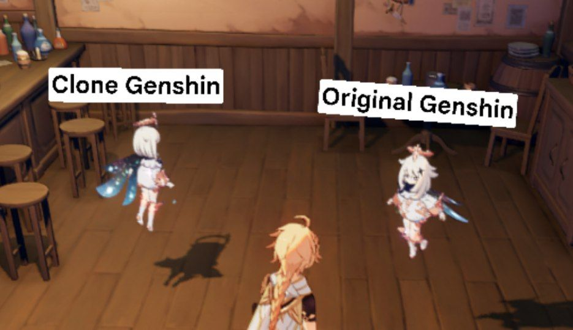

# YuukiPS
 
EN | [ID](https://github.com/ElaXan/YuukiProxy/blob/main/README-id.md)

Clone APK YuukiPS  
No Termux and No Root  
Clone by [ElaXan](https://discord.com/users/506212044152897546)

# Disclaimer
This not made by me, Module created by [Yuuki](https://github.com/akbaryahya) i just make to clone apk, for you dont know how to do it. and also i already ask [Yuuki](https://github.com/akbaryahya) for i share this on Github, Join [Discord](https://discord.gg/yuukips) if need help and more update, i cant help you if got error. Because this not made by me

# Download
Download [YuukiPS 3.0](https://github.com/ElaXan/YuukiProxy/releases/tag/3.0)

### Error
* If not show menu for Playing PS. Check for new Patch in [release](https://github.com/ElaXan/YuukiProxy/releases)

* If you have problem like "Failed to Extract il2cpp" maybe have problem with your Data Genshin Impact. You can try re download for data, if still like that. So high chance your Device is not support

* For Termux method\
Go to [AnimeGamePatch](https://github.com/ElaXan/AnimeGamePatch)

# Play
I suggest having only 1 data, not creating a new data folder to play Private Server

So just rename your data in Android/data folder  
rename 
`com.miHoYo.GenshinImpact` to `com.miHoYo.GenshinImpactzex` or `com.miHoYo.GenshinImpactzexo`  
 if want play official server  
rename `com.miHoYo.GenshinImpactzex` or `com.miHoYo.GenshinImpactzexo` to `com.miHoYo.GenshinImpact`
